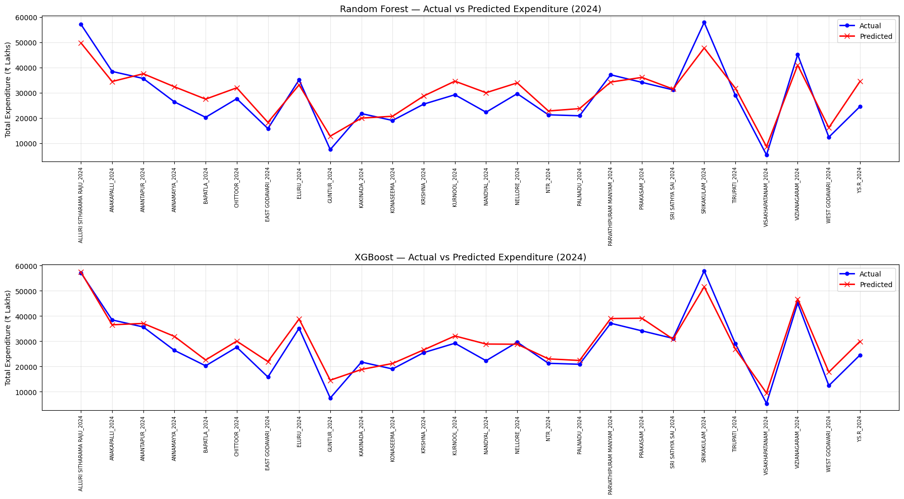
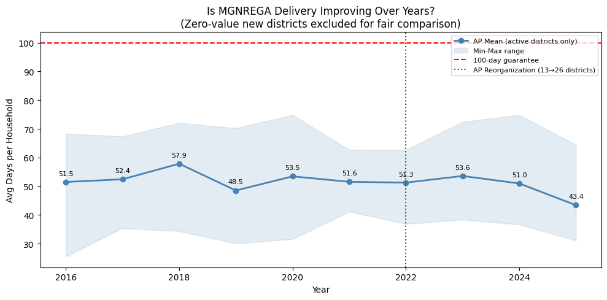

# AP District-Wise MGNREGA Expenditure Analysis

> Applying data mining and machine learning to 9 years of government data to understand why India's largest rural employment scheme delivers only half its promised 100 days — and predict where it goes next.

---

## What This Project Is About

MGNREGA guarantees 100 days of paid work per year to every rural household in India. On paper, it is one of the world's most ambitious social protection programmes. In practice, the numbers tell a different story.

This project mines district-level MGNREGA data from Andhra Pradesh (2016–2024) to answer three questions:

- **What is actually being delivered?** EDA across 156 district-year records reveals a chronic 47.7-day shortfall — AP districts average just 52.3 days, and no district consistently achieves the full guarantee.
- **What drives that shortfall?** A standardized regression explanation model identifies pending liabilities (unpaid dues carried over from prior years) as the strongest negative driver of employment delivery.
- **Can we predict future spending?** Two ML models forecast persondays generated and total district expenditure with R² = 0.90, enabling data-driven budget planning.

---

## Key Findings

| Metric | Value |
|---|---|
| Average days delivered vs. 100-day guarantee | **52.3 days** |
| Best year (mean across districts) | 2018 — 57.9 days |
| Worst year | 2019 — 48.5 days |
| Model 1: Persondays prediction (CV R²) | **0.90** |
| Model 2: Expenditure prediction (R²) | **0.90**, MAPE ≈ 18% |
| Strongest negative driver of delivery | `prev_total_liability` (pending dues) |
| Strongest positive driver | `avg_wage_per_day`, `works_in_progress` |

---

## Project Structure

```
mgnrega-analysis/
│
├── datasets/
│   └── clean_mgnrega_dataset.csv          # Data sets- RAW, Merged and cleaned.
│   └── ...
├───merge.py                    # Reads all year-wise XLS files, extracts tables, concatenates           
│ └─clean.py                # Renames columns, filters rows, handles 2025 exclusion, saves clean CSV
│
├──explanation_model.ipynb # EDA, year-wise trends, correlation heatmap, standardized coefficients
│ ├── model1_persondays.ipynb # Random Forest — persondays prediction, leakage removal, CV evaluation
│ └── model2_expenditure.ipynb# XGBoost — expenditure prediction, temporal split, hyperparameter tuning
│
└── README.md
```

---

## Data

**Source:** [MGNREGA MIS Portal](https://nreganarep.nic.in) — official Government of India reporting system.

**How to get the data:**
1. Go to https://nreganarep.nic.in
2. Navigate to: Reports → Financial → Statement of Expenditure (District-wise)
3. Download one XLS file per financial year (2016-17 to 2024-25)
4. Place all files in the `data/` folder
5. Run `python scripts/merge.py` → produces `master_merged_data.csv`
6. Run `python scripts/clean.py` → produces `clean_mgnrega_dataset.csv`

**Dataset after cleaning:**

| Attribute | Value |
|---|---|
| Records | 156 district-year rows |
| Years | 2016-17 to 2024-25 (9 years) |
| Districts | 13 (pre-2022) → 26 (post-reorganization) |
| Features | 19 columns (see Appendix below) |

---

## A Critical Data Challenge: The 2022 Reorganization

Andhra Pradesh expanded from 13 to 26 districts in April 2022. The 13 new districts show **zero values for all metrics from 2016–2021** — they simply didn't exist as separate administrative units.

Naively averaging across all 26 districts for pre-2022 years would create a false downward trend. The fix: **exclude zero-value rows when computing year-wise statistics**, so pre-2022 averages reflect the 13 original districts and post-2022 averages reflect all 26.

A binary flag `is_post_reorganization` was added as a model feature to capture this structural break.

---

## The Leakage Problem (And Why It Matters)

The original model reported R² = 0.985 for persondays prediction. This looked impressive — and was wrong.

The feature `avg_wage_per_day` creates a near-arithmetic relationship with the target:

```
persondays ≈ exp_unskilled_wage / avg_wage_per_day
```

Including it meant the model wasn't learning anything — it was just rearranging an identity. After removing it, R² dropped to an honest **0.90**, which is what the model actually earns on genuinely unseen inputs.

This is documented in `model1_persondays.ipynb` with a direct comparison of leaky vs. clean model performance.

---

## Models

### Model 1 — Predicting Persondays Generated
- **Algorithm:** Random Forest Regression
- **Features:** `exp_unskilled_wage`, `exp_material`, `admin_exp` + year and district dummies
- **Evaluation:** 5-fold cross-validation (KFold, shuffle=True)
- **Result:** CV R² = 0.90, CV Std = 0.032

### Model 2 — Predicting District Expenditure
- **Algorithm:** XGBoost Regression
- **Features:** `avg_wage_per_day`, all prior-year liability columns, `works_in_progress`, `prev_year_total_exp` (lag), `is_post_reorganization` + dummies
- **Evaluation:** Temporal train-test split — train on 2017–2023, test on 2024
- **Result:** R² = 0.90, MAPE = 18.03%, Relative RMSE = 13.50%

| Model | R² | MAPE |
|---|---|---|
| Random Forest (baseline, Model 2) | 0.82 | 19.66% |
| XGBoost baseline | 0.87 | 18.69% |
| **XGBoost tuned (final)** | **0.90** | **18.03%** |


---

## Explanation Model Findings

The explanation model uses standardized linear regression on `avg_days_per_household` — the primary measure of how well the 100-day guarantee is being delivered.



Key takeaways:
- **`prev_total_liability` is the strongest negative driver** — districts carrying more unpaid dues from prior years deliver fewer employment days, likely because incoming funds are diverted to clear arrears instead of generating new work.
- **`avg_wage_per_day` and `works_in_progress`** are the strongest positive drivers — higher wage rates and more carried-over ongoing works both correlate with better delivery.
- Rising budget allocations are **not translating proportionally** into employment days — efficiency per rupee is declining year over year.

---

## Tech Stack

| Component | Tool |
|---|---|
| Language | Python 3.12 |
| Data Processing | pandas, numpy |
| Machine Learning | scikit-learn, XGBoost |
| Visualization | matplotlib, seaborn |
| Environment | Jupyter Notebook |

---

## Setup

```bash
git clone https://github.com/yourusername/mgnrega-analysis.git
cd mgnrega-analysis
pip install -r requirements.txt
```

Then follow the **Data** section above to download and prepare the dataset before running any notebooks.

---

## Appendix — Dataset Column Reference

| Column | Description |
|---|---|
| `district` | AP district name |
| `year` | Financial year |
| `exp_unskilled_wage` | Expenditure on unskilled wage payments (₹) |
| `exp_material` | Expenditure on materials |
| `admin_exp` | Administrative expenditure (capped at 6%) |
| `total_exp_without_liability` | Total current-year expenditure — **Model 2 target** |
| `prev_total_liability` | Total pending dues from previous year |
| `persondays_generated` | Total person-days of employment — **Model 1 target** |
| `avg_days_per_household` | Average days worked per household — **Explanation target** |
| `avg_wage_per_day` | Government-notified daily wage rate |
| `works_completed` | Number of works fully completed |
| `works_in_progress` | Number of works ongoing at year-end |
| `households_employed` | Number of households that worked |
| `prev_year_total_exp` | Lag feature — prior year expenditure |
| `is_post_reorganization` | Binary flag for post-2022 district structure |

---

## Policy Implications

This analysis suggests two concrete levers for improving MGNREGA delivery in AP:

1. **Clear pending liabilities promptly.** The strongest negative driver of employment days is accumulated unpaid dues. Timely fund release and liability clearance directly frees up capacity for new employment generation.
2. **Audit efficiency, not just spending.** Budget allocations have risen year-over-year but employment days have not kept pace. Policy attention should shift from total expenditure to employment generated per rupee.

---

*Data sourced from the official MGNREGA MIS Portal. Analysis conducted as part of CSE4005 – Data Warehousing and Data Mining, VITAP University.*